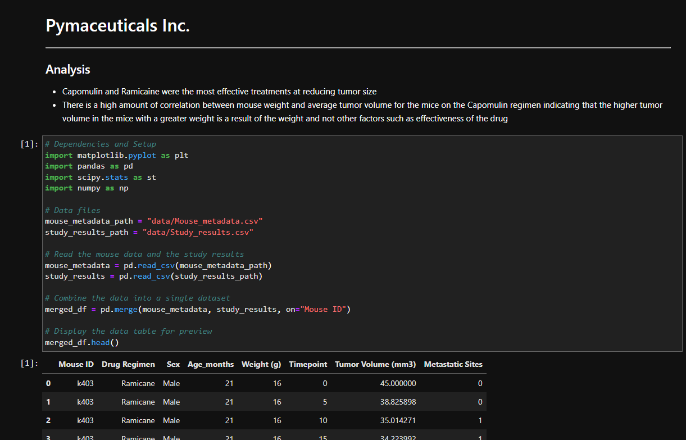

# A technical report of a clinical study using matplotlib

*Jupyter notebook is in the root directory and CSV data is in the data directory*

### Directory structure
pymaceuticals.ipynb  
data/  
├─ Mouse_metadata.csv  
├─ Study_results.csv  

